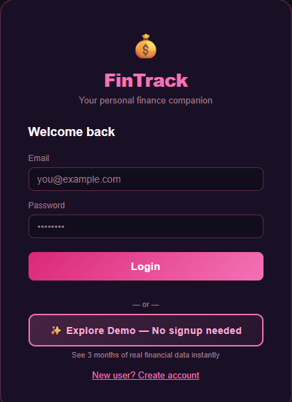
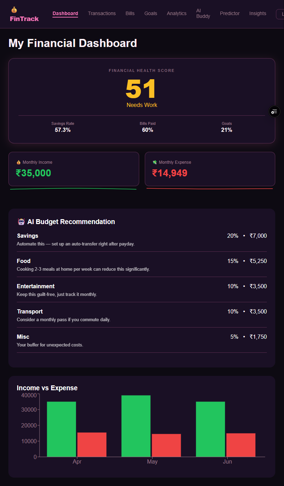
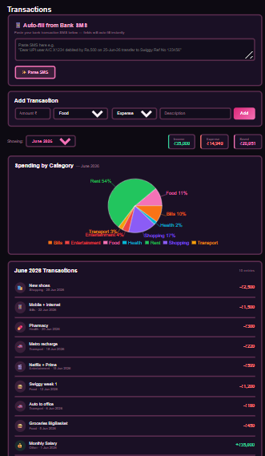
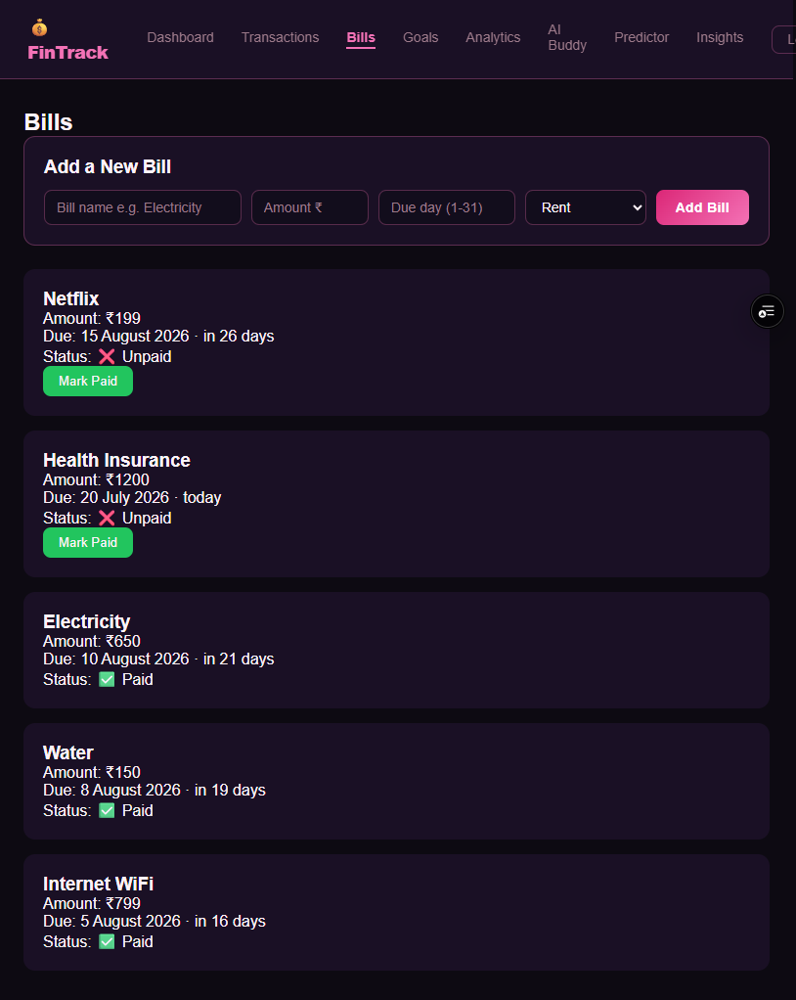
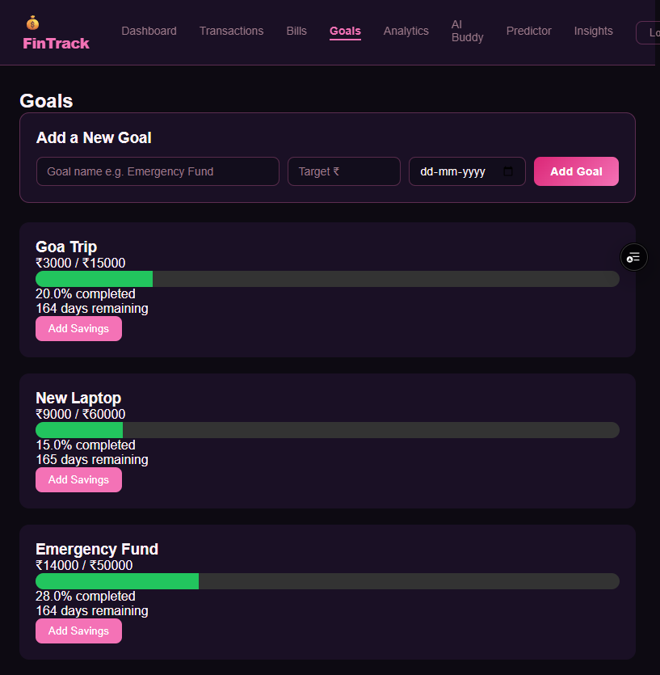
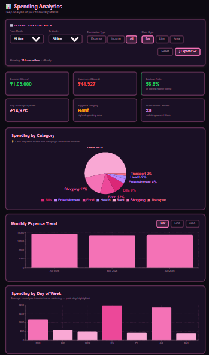
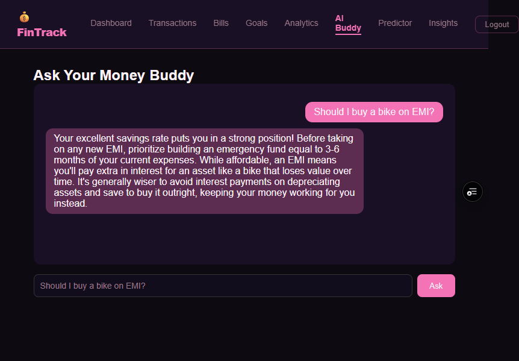
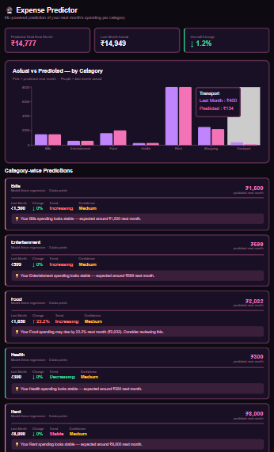
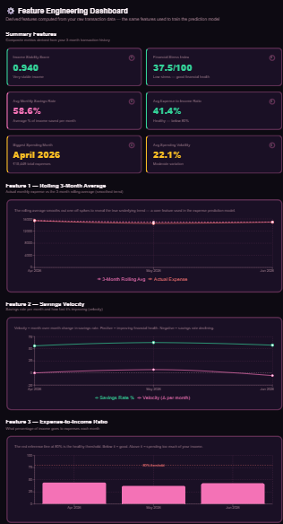

# 💰 FinTrack — Personal Finance Companion

FinTrack is a personal finance web app built to help newly employed people track spending, understand their financial habits, and make better money decisions using data science and machine learning.

**Live app:**  https://fintrack-smoky-one.vercel.app/

**Backend API docs:** https://fintrack-ad7s.onrender.com/docs
> Note: the backend is hosted on Render's free tier, so the first request after inactivity may take 30-60 seconds to wake up.

> Try it instantly with the **Explore Demo** button on the login page — no signup needed, preloaded with 3 months of sample data.

---

## Why I built this

Becoming financially independent for the first time is exciting — and stressful. Most first-time earners have never had to manage their own bills, savings, and spending before, and there's no simple way to know if they're doing it right. FinTrack is built to take that stress away: it helps first-time earners understand where their money is going, plan around their bills and savings goals, and build the habit of managing money the right way from the very start — instead of learning it the hard way after something goes wrong.

---

## Features

- **Secure authentication** — Firebase Auth (email/password), with guided onboarding for new users
- **Transaction tracking** — manual entry or auto-fill by pasting a bank SMS (regex-based parser extracts amount, merchant, and category)
- **Bills & Goals** — recurring bill reminders with paid/unpaid tracking, savings goals with progress bars and deadlines
- **Financial Health Score** — a single 0–100 score blending savings rate, bill consistency, and goal progress
- **AI Budget Recommendation** — rule-based 50/30/20 budget allocation with personalized tips (RL-based optimizer used in earlier iterations, now rule-based for production stability)
- **Spending Analytics** — interactive category breakdowns, month-over-month change, day-of-week spending patterns, CSV export
- **ML Expense Predictor** — per-category next-month spending forecasts using Random Forest / Linear Regression depending on available history, with confidence scoring
- **Feature Engineering Dashboard** — derived signals (income stability score, financial stress index, spending volatility) explained in plain language
- **AI Buddy** — Gemini-powered chat for financial questions grounded in the user's own data

---

## Screenshots

### Login


### Dashboard


### Transactions


### Bills


### Goals


### Spending Analytics


### AI Buddy


### Expense Predictor


### Feature Engineering Insights


---

## Tech Stack

| Layer          | Technology                                          |
|----------------|------------------------------------------------------|
| Frontend       | React, Recharts, deployed on Vercel                  |
| Backend        | FastAPI (Python), deployed on Render                 |
| Database       | Supabase (PostgreSQL)                                |
| Auth           | Firebase Authentication + Admin SDK                  |
| ML / Analytics | Scikit-learn (Random Forest, Linear Regression), Pandas, NumPy |
| AI Chat        | Google Gemini API                                    |

---

## Architecture

```
React (Vercel)  ──HTTPS──►  FastAPI (Render)  ──►  Supabase Postgres
      │                            │
      └── Firebase Auth ◄──────────┘  (ID token verified on every request)
```

- Every backend route is protected by a Firebase ID token, verified server-side via the Firebase Admin SDK.
- New users are auto-provisioned on first login (`get_or_create_user`), with a guided onboarding flow that seeds their first transaction from their declared monthly income.
- Analytics endpoints are defensively coded to degrade gracefully (return sensible defaults, never crash) for brand-new accounts with little or no transaction history.

---

## Getting Started (local setup)

### Backend
```bash
cd fintrack-backend
pip install -r requirements.txt --break-system-packages
uvicorn main:app --reload
```
Create a `.env` file with:
```
DATABASE_URL=your_supabase_connection_string
GEMINI_API_KEY=your_gemini_key
SECRET_KEY=your_secret_key
FIREBASE_CREDENTIALS=your_firebase_service_account_json (or use firebase-key.json locally)
```

### Frontend
```bash
cd fintrack-frontend
npm install
npm start
```
Create a `.env` file with:
```
REACT_APP_API_URL=http://localhost:8000
REACT_APP_FIREBASE_API_KEY=your_firebase_web_api_key
```

---

## What I'd improve next

- Add SIP and mutual fund tracking so users can monitor investments alongside their spending and savings
- Move budget optimization back to the trained RL model (currently rule-based in production due to memory limits on the free-tier host)
- Add recurring transaction detection (subscriptions) automatically from patterns
- Expand the SMS parser to support more Indian bank formats
- Add unit tests for the analytics endpoints

---

## Author

Built by Jyoti Kanyal, B.Tech Computer Science (Data Science & Analytics), DIT University.

